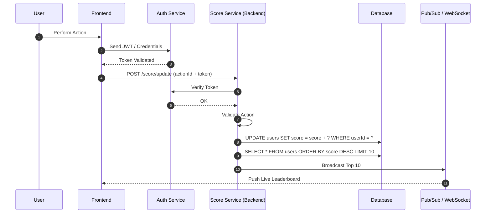

# Specification: Live Scoreboard Service

**Version:** 1.0
**Author:** Gemini AI
**Date:** 2026-02-26

## 1. Overview

The Live Scoreboard Service provides a real-time leaderboard of users based on their scores. Its primary goals are:

1.  Process user score updates efficiently and securely.
2.  Maintain and broadcast the top 10 leaderboard with minimal latency.
3.  Scale to moderate-to-high concurrency scenarios.
4.  Ensure consistency across multiple server instances.

This service combines REST APIs for command operations and WebSockets for real-time updates.
The relational database serves as the primary source of truth for leaderboard data,
with indexed Top-N queries used to efficiently retrieve the top 10 users.

The architecture is intentionally kept simple and database-driven,
while allowing future evolution toward a cache layer or distributed messaging
system if higher scalability requirements emerge.

## 2. Core Requirements

### Functional Requirements

- **FR1**: The system must expose an API endpoint for users to update their own score.
- **FR2**: The system must maintain a list of the top 10 users by score.
- **FR3**: The system must push live updates to all connected clients whenever the top 10 scoreboard changes.
- **FR4**: The system must provide an endpoint to fetch the current top 10 scores for initial page load.
- **FR5**: The system must ensure score updates are atomic and consistent across all service instances.

### Non-Functional Requirements

- **NFR1 (Security)**: Score updates must be authenticated and authorized. Users must only be able to update their own score.
- **NFR2 (Real-time)**: Updates to the scoreboard should appear on the client-side with minimal delay.
- **NFR3 (Scalability)**: The system should be designed to handle a moderate number of concurrent client connections.
- **NFR4 (Consistency)**: Top 10 leaderboard must reflect the most recent updates across all instances.
- **NFR5 (Observability)**: Metrics, logging, and alerts for update frequency, broadcast failures, and user activity.
- **NFR6 (Reliability)**: Handle service restarts or node failures without losing leaderboard state.

## 3. Architecture & Design

A hybrid approach using both a **REST API** and **WebSockets** is recommended.

- **REST API (HTTP)**: Used for command-like operations, such as updating a score or fetching the initial scoreboard state.
- **WebSockets**: Used for pushing asynchronous, real-time updates from the server to all connected clients.

### Recommended Tech Stack

- **Backend Framework**: Express.js (or similar)
- **Database**: PostgreSQL, MySQL, or similar relational database.
- **WebSocket Library**: `Socket.IO` or `ws`
- **Authentication**: JSON Web Tokens (JWT).

## 4. Execution Flow

The following diagram illustrates the sequence of events from a user action to the scoreboard being updated on all clients.



## 5. API & Event Specification

### 5.1 REST API

---

#### `POST /api/score/update`

- **Auth**: JWT required.
- **Request Body**:
  ```json
  {
    "points": 10
  }
  ```
- **Response 200**:
  ```json
  {
    "userId": 123,
    "newScore": 150,
    "rank": 5
  }
  ```
- **Error Responses**:
  - `400 Bad Request`: Invalid points.
  - `401 Unauthorized`: JWT missing or invalid.
  - `429 Too Many Requests`: Rate limit exceeded.

- **Advanced Logic**:
  - Only positive integers allowed.
  - Persist changes in DB asynchronously to reduce write latency.

---

#### `GET /api/score/top10`

- **Auth**: Optional.
- **Response 200**:
  ```json
  [
    {
      "userId": 45,
      "username": "PlayerOne",
      "score": 9990,
      "rank": 1
    }
  ]
  ```
- **Implementation Notes**:
  - The leaderboard is queried directly from the relational database.
  - Ensure the following composite index exists for optimal Top-N queries:

  ```sql
  CREATE INDEX idx_users_score_updated_at
  ON users (score DESC, updatedAt ASC);
  ```

### 5.2 WebSocket Events

- **Event**: `scoreboard:update`
- **Description**: Broadcast whenever the top 10 leaderboard changes.
- **Payload**:
  ```json
  [
    {
      "userId": 45,
      "username": "PlayerOne",
      "score": 9990,
      "rank": 1
    },
    ...
  ]
  ```
- **Notes**:
  - Include `rank` for easier client display.
  - Include timestamp of last update for consistency checks.

## 6. Data Models

#### `User` (in a relational database)

| Field     | Type      | Description                     |
| --------- | --------- | ------------------------------- |
| id        | Integer   | Primary Key                     |
| username  | String    | Public display name             |
| score     | Integer   | Current score                   |
| updatedAt | Timestamp | Last score update (tie-breaker) |
| createdAt | Timestamp | User creation time              |

## 7. Advanced Considerations

### 7.1 Performance & Scaling

- **Top 10 Query Optimization**:
  - Use Redis Sorted Sets for constant-time top N queries.
  - Database `score` column must be indexed for fallback.
- **Horizontal Scaling**:
  - Multiple backend instances can run behind a load balancer.
  - Redis Pub/Sub ensures leaderboard events are broadcast to all clients regardless of instance.
- **Rate Limiting**:
  - Per-user limit, e.g., 1 score update per second.
  - Helps prevent abuse and server overload.
- **Batching Updates**:
  - For extremely high-frequency scoring, consider batching writes to DB while broadcasting via Redis in real-time.

### 7.2 Consistency & Tie-Breaking

- **Tie-breaker**: `updatedAt ASC` ensures first-to-achieve score ranks higher.
- Redis ensures eventual consistency across multiple nodes, while DB ensures persistent correctness.

### 7.3 Observability

- **Metrics to track**:
  - Score updates per second.
  - Number of WebSocket clients connected.
  - Top 10 leaderboard update frequency.
  - Cache hit/miss rate.
- **Logging**:
  - Log invalid JWT attempts.
  - Log broadcast failures and retries.
- **Alerts**:
  - High latency (>200ms) for leaderboard push.
  - Redis or DB errors.

### 7.4 Security

- JWT verification for all write operations.
- Input validation to prevent injection attacks.
- Rate limiting and IP throttling to mitigate abuse.
- WebSocket auth handshake using the same JWT.

### 7.5 Future Improvements

- Global leaderboard with pagination.
- Regional leaderboards for geographic competitions.
- Multi-game or multi-category support.
- Replay or event sourcing to track historical leaderboard changes.
- Persistent WebSocket reconnection & message replay.
